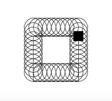

# RoboLang
### An educational programming language for algorithimic art

Robolang allows novice computer programmers and children to explore the land of algorithmic art(a specialization of generative art) and encouraging them to become Algorithmic artists or algorists using a very simplified subset of Structured Programming and a simple metaphor of controlling a Robot!

## Example

### `Code`
```
begin
    goto 100,100
    repeat 10
        left 10
        circle 20
    end
    repeat 10
        down 10
        circle 20
    end
    repeat 10
        right 10
        circle 20
    end
    repeat 10
        up 10
        circle 20
    end
end
```
### `Output`


